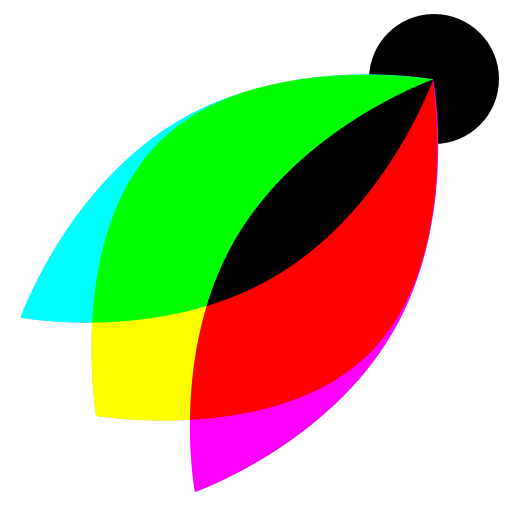

<p align="center">
  
  <br>
  <a href="https://www.npmjs.org/package/visbug"></a>
  <a href="https://www.npmjs.com/package/visbug"></a>
</p>

# VisBug

> Open source web design tools

- **Simple** as point, click & tinker
- Edit or style **any page**, in **any state**, like it's an artboard
- **Hover inspect** styles, accessibility and alignment
- **Nitpick** layouts & content, **in the real end environment**, at any device size
- **Leverage** adobe/sketch **skills**
- **Edit** any text, **replace** any image (hi there copywriters, ux writers, pms)
- Design **within the chaos**: use production or prototypes and the **odd states** they produce, **as artboards** and design opportunities
- Design **while simulating** latency, i18n, media queries, platform constraints, CPUs, screensize, etc
- **Make more decisions** on the front end of your site/app (a11y, responsive, edge cases, etc)
- **No waiting** for developers to expose their legos, **just go direct** and edit the end state (regardless of framework) and **execute/test an idea**

[Master List of Keyboard Commands](https://github.com/GoogleChromeLabs/ProjectVisBug/wiki/Keyboard-Master-List)

### Give **power to designers & content creators**, in a place where they currently feel they have little to none, **by bringing design tool interactions and hotkeys to the browser**

Check out the [list of features me and other's are wishing for](https://github.com/GoogleChromeLabs/ProjectVisBug/issues?q=is%3Aopen+is%3Aissue+label%3A%22%E2%9A%A1%EF%B8%8F+feature%22). There's a lot of fun stuff planned or in demand. Cast your vote on a feature, leave some feedback or add clarity. 

Let's do this **Design community, I'm looking at you** first. Make a GitHub account and start dreamin' in the issues area! Help create the tool you need to do your job better.


> 🤔 **It's not:**
>
> -   **A competitor** to design tools like Figma, Sketch, XD, etc; **it's a complement**
> -   Something you would use **to start from scratch**
> -   A **design system recognizer**, enforcer, enabler, or anything
> -   An **interaction** prototyping tool

## Installation

### Add to your browser
[Chrome Extension](https://chrome.google.com/webstore/detail/cdockenadnadldjbbgcallicgledbeoc)  
[Firefox Add-on](#) (coming soon!)

### Web Component (coming soon 💀🤘)
```sh
npm i visbug
```

## Tool Architecture
**VisBug is a custom element** on your page that intercepts interactions, selecting the item(s) instead, and then provides keyboard driven patterns to manipulate the selected DOM nodes. It can do these things on any page without the need for extension or browser priveledges. Extension integrations are to power a 2nd screen experience, while also providing browser specific features to enhance the experience. 

The illusion of selection and hover interactions are **more custom elements**. They are sag positioned overtop the elements to provide the same visual feedback that design tools do. It is essential that these elements leverage the shadow DOM; they're in a foreign environment yet need to look the same across any page. 

**Each tool is a function** that gets called when the user changes tools, and expects the feature function to return a function for disassembly/cleanup. Think of it as, "hey feature, you're up" and then later "hey feature, your turn is up, clean up." 

It's the responsibility of each feature to register keyboard listeners and handle the manipulations. It's a courtesty to expose functions from a feature for other features to use. **Features must be able to handle multiselect**. 


## Contribute

First off, thanks for taking the time to contribute!
Now, take a moment to be sure your contributions make sense to everyone else.

### Reporting Issues

Found a problem? Want a new feature? First of all see if your issue or idea has [already been reported](../../issues).
If it hasn't, just open a [new clear and descriptive issue](../../issues/new).

### Submitting pull requests

Pull requests are the greatest contributions, so be sure they are focused in scope, and do avoid unrelated commits.

> 💁 **Remember: size is the #1 priority.**
>
> Every byte counts! PR's can't be merged if they increase the output size much.

-   Fork it!
-   Clone your fork: `git clone https://github.com/<your-username>/ProjectVisBug`
-   Navigate to the newly cloned directory: `cd ProjectVisBug`
-   Create a new branch for the new feature: `git checkout -b my-new-feature`
-   Install the tools necessary for development: `npm install`
-   Make your changes.
-   `npm run build` to verify your change doesn't increase output size.
-   `npm test` to make sure your change doesn't break anything.
-   Commit your changes: `git commit -am 'Add some feature'`
-   Push to the branch: `git push origin my-new-feature`
-   Submit a pull request with full remarks documenting your changes.

## License

[Apache2 License](LICENSE) © [Adam Argyle](https://argyleink.com)
